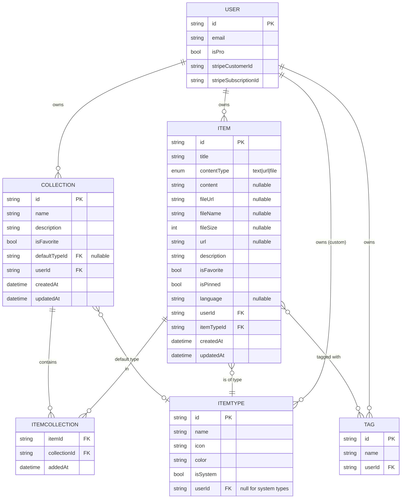
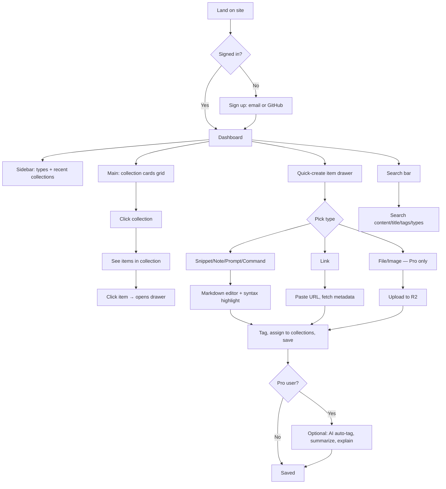

# DevStash — Project Overview

> One fast, searchable, AI-enhanced hub for everything a developer stashes: snippets, prompts, commands, notes, links, and files.

**Status:** Planning
**Stack:** Next.js 16 · React 19 · TypeScript · Prisma · PostgreSQL (Neon) · NextAuth v5 · Tailwind v4 · shadcn/ui · Cloudflare R2 · OpenAI

---

## 1. Problem

Developers keep their essentials scattered across too many places:

| What | Where it usually lives |
|---|---|
| 📄 Code snippets | VS Code scratch files, Notion |
| ✨ AI prompts | ChatGPT / Claude history |
| 📝 Context files | Buried inside random projects |
| 🔗 Useful links | Browser bookmarks |
| 📚 Docs | Random folders, Downloads |
| 💻 Commands | `notes.txt`, bash history |
| 🧱 Templates | GitHub gists |

The result: context switching, lost knowledge, and inconsistent workflows. **DevStash centralizes all of it in one place.**

---

## 2. Target Users

- **Everyday Developer** — fast capture and recall of snippets, prompts, commands, links.
- **AI-First Developer** — saves prompts, contexts, workflows, system messages.
- **Content Creator / Educator** — stores code blocks, explanations, course notes.
- **Full-Stack Builder** — collects patterns, boilerplates, API examples.

---

## 3. Core Concepts

### 3.1 Items

Items are the atomic unit. Every item has a **type**. Types fall into three storage modes:

| Mode | Types | Notes |
|---|---|---|
| `text` | snippet, note, prompt, command | Stored as text in DB |
| `url` | link | Just a URL + metadata |
| `file` | file, image | Stored in Cloudflare R2 (Pro only) |

System types (locked, can't be edited):

| Type | Color | Icon (Lucide) | Storage |
|---|---|---|---|
| Snippet | `#3b82f6` blue | `Code` | text |
| Prompt | `#8b5cf6` purple | `Sparkles` | text |
| Command | `#f97316` orange | `Terminal` | text |
| Note | `#fde047` yellow | `StickyNote` | text |
| Link | `#10b981` emerald | `Link` | url |
| File | `#6b7280` gray | `File` | file (Pro) |
| Image | `#ec4899` pink | `Image` | file (Pro) |

Custom user-defined types come later (Pro feature).

URL convention: `/items/snippets`, `/items/prompts`, etc.
Items open in a quick-access **drawer** rather than a full page.

### 3.2 Collections

User-created groupings. An item can belong to **multiple collections** (many-to-many via `ItemCollection` join table).

Examples:
- "React Patterns" (snippets + notes)
- "Context Files" (files)
- "Python Snippets" (snippets)
- "Interview Prep" (snippets + notes — same React snippet could live here too)

### 3.3 Tags

Lightweight, free-form labels. Many-to-many with items.

---

## 4. Features

### Free for all users
- Items: create, edit, delete, favorite, pin, search
- Collections: create, manage, favorite
- Multi-collection assignment + view which collections an item belongs to
- Markdown editor for text types with syntax highlighting
- Recently used view
- Import code from a file
- Dark mode (default) + light mode
- Search across content, titles, tags, and types

### 4.1 Authentication
- Email/password
- GitHub OAuth
- (Powered by NextAuth v5)

### 4.2 AI Features (Pro)
- Auto-tag suggestions
- Item summaries
- "Explain this code"
- Prompt optimizer

Model: **OpenAI `gpt-5-nano`**

---

## 5. Monetization

Freemium model.

| | Free | Pro ($8/mo or $72/yr) |
|---|---|---|
| Items | 50 max | Unlimited |
| Collections | 3 max | Unlimited |
| System types | All except files/images | All |
| Custom types | ❌ | ✅ (later) |
| File/Image upload | ❌ | ✅ |
| Search | Basic | Basic |
| AI auto-tag | ❌ | ✅ |
| AI explain code | ❌ | ✅ |
| AI prompt optimizer | ❌ | ✅ |
| Export (JSON/ZIP) | ❌ | ✅ |
| Support | Standard | Priority |

> **Dev note:** Build the Pro infrastructure (Stripe hooks, `isPro` checks) from day one, but during development all users get everything. Toggle gating on before launch.

---

## 6. Data Model

### 6.1 ER Diagram



### 6.2 Prisma Schema (starting point)

```prisma
// schema.prisma
generator client {
  provider = "prisma-client-js"
}

datasource db {
  provider = "postgresql"
  url      = env("DATABASE_URL")
}

enum ContentType {
  TEXT
  URL
  FILE
}

model User {
  id                   String        @id @default(cuid())
  email                String        @unique
  name                 String?
  image                String?
  emailVerified        DateTime?

  // Monetization
  isPro                Boolean       @default(false)
  stripeCustomerId     String?       @unique
  stripeSubscriptionId String?       @unique

  // AI quota
  aiQuotaMonthly       Int           @default(100)  // configurable default
  aiQuotaOverride      Int?          // per-user upsell override
  aiUsageThisMonth     Int           @default(0)
  aiUsageResetAt       DateTime      @default(now())

  // Relations
  items                Item[]
  collections          Collection[]
  customTypes          ItemType[]
  tags                 Tag[]
  accounts             Account[]     // NextAuth
  sessions             Session[]     // NextAuth

  createdAt            DateTime      @default(now())
  updatedAt            DateTime      @updatedAt
}

model Item {
  id           String           @id @default(cuid())
  title        String
  description  String?

  contentType  ContentType
  content      String?          // text content (snippet/prompt/note/command)
  url          String?          // for link types
  fileUrl      String?          // R2 URL for file/image
  fileName     String?
  fileSize     Int?

  language     String?          // optional code language hint
  isFavorite   Boolean          @default(false)
  isPinned     Boolean          @default(false)
  deletedAt    DateTime?        // soft delete; hard-deleted after 30-day grace period

  user         User             @relation(fields: [userId], references: [id], onDelete: Cascade)
  userId       String

  itemType     ItemType         @relation(fields: [itemTypeId], references: [id])
  itemTypeId   String

  collections  ItemCollection[]
  tags         ItemTag[]

  createdAt    DateTime         @default(now())
  updatedAt    DateTime         @updatedAt

  @@index([userId])
  @@index([itemTypeId])
}

model ItemType {
  id          String       @id @default(cuid())
  name        String
  icon        String       // Lucide icon name
  color       String       // hex
  isSystem    Boolean      @default(false)

  user        User?        @relation(fields: [userId], references: [id], onDelete: Cascade)
  userId      String?      // null for system types

  items       Item[]
  defaultFor  Collection[] @relation("CollectionDefaultType")

  @@unique([userId, name])
}

model Collection {
  id             String           @id @default(cuid())
  name           String
  description    String?
  isFavorite     Boolean          @default(false)

  defaultType    ItemType?        @relation("CollectionDefaultType", fields: [defaultTypeId], references: [id])
  defaultTypeId  String?

  user           User             @relation(fields: [userId], references: [id], onDelete: Cascade)
  userId         String

  items          ItemCollection[]

  createdAt      DateTime         @default(now())
  updatedAt      DateTime         @updatedAt

  @@index([userId])
}

model ItemCollection {
  item         Item       @relation(fields: [itemId], references: [id], onDelete: Cascade)
  itemId       String
  collection   Collection @relation(fields: [collectionId], references: [id], onDelete: Cascade)
  collectionId String
  addedAt      DateTime   @default(now())

  @@id([itemId, collectionId])
  @@index([collectionId])
}

model Tag {
  id     String    @id @default(cuid())
  name   String
  user   User      @relation(fields: [userId], references: [id], onDelete: Cascade)
  userId String
  items  ItemTag[]

  @@unique([userId, name])
  @@index([userId])
}

model ItemTag {
  item    Item   @relation(fields: [itemId], references: [id], onDelete: Cascade)
  itemId  String
  tag     Tag    @relation(fields: [tagId], references: [id], onDelete: Cascade)
  tagId   String

  @@id([itemId, tagId])
  @@index([tagId])
}

// NextAuth models (Account, Session, VerificationToken) go here
```

> **Migration rule (from notes):** Never use `prisma db push` against any environment. Always create migrations (`prisma migrate dev`) and run them in dev → prod.

---

## 7. User Flow



---

## 8. UI / UX

**Design language:** Modern, minimal, dev-focused. References: **Notion · Linear · Raycast**.

- Dark mode default, light optional
- Clean typography, generous whitespace, subtle borders/shadows
- Syntax highlighting on all code blocks (snippets, commands)

**Layout:**
- **Sidebar (collapsible):** item types with counts, recent collections
- **Main:** grid of color-coded collection cards
  - Card **background** = color of dominant item type in that collection
  - Items inside use **border color** of their own type (so a mixed collection still reads at a glance)
- **Item drawer:** opens over current view for quick edit/copy without losing context

**Responsive:** desktop-first; on mobile the sidebar becomes a drawer.

**Micro-interactions:** smooth transitions, hover states on cards, toast notifications, loading skeletons.

**Screenshots**: Refer to the screen shots below as a base for the dashboard UI. It does not need to be exact, use it as a reference.
- @context/screenshots/DevStash-Dashboard-UI-Main.png
- @context/screenshots/DevStash-Dashboard-ui-with-Drawer.png

---

## 9. Tech Stack Summary

| Layer | Choice | Notes |
|---|---|---|
| Framework | Next.js 16 + React 19 | App router, SSR pages, dynamic components, API routes |
| Language | TypeScript | Strict mode |
| Database | Neon (Postgres) | Serverless Postgres |
| ORM | Prisma 7 | Fetch latest docs before scaffolding |
| Auth | NextAuth v5 | Email/password + GitHub OAuth |
| File storage | Cloudflare R2 | For file/image uploads (Pro) |
| AI | OpenAI `gpt-5-nano` | Tagging, summaries, explanations, prompt optimization |
| Styling | Tailwind v4 + shadcn/ui | |
| Caching | Redis | Optional — defer until needed |
| Payments | Stripe | Subscriptions for Pro tier |
| Repo | Monorepo (single Next.js app) | Less overhead |

---

## 10. Decisions

1. **`contentType` enum.** `TEXT | URL | FILE` — link items use `URL`, file/image use `FILE`, all others use `TEXT`.
2. **Search depth.** Same for Free and Pro — full-text search across title, content, tags, and type. No tier difference.
3. **Limits enforcement.** Both app-layer (UX / upgrade prompt) and DB constraint (safety net).
4. **Tag ownership.** Per-user tags — scoped by `userId`, not global.
5. **File size cap.** 25 MB default, stored in config (not hardcoded) to support tiered upsell for more storage in the future.
6. **Custom type deletion.** Cascade delete items, but show a confirmation modal with the count of affected items first. Items are soft-deleted (`deletedAt` timestamp) with a 30-day grace period before hard deletion.
7. **AI cost control.** Monthly AI quota per user, configurable via env/config. Per-user quota override as a future upsell lever.
8. **Export format.** Full structure — collections, tags, and metadata included (not a flat list).
9. **Onboarding.** Seed a "Welcome" collection with one example item per type on new user signup.

---

## 11. Useful References

- [Next.js docs](https://nextjs.org/docs)
- [Prisma docs](https://www.prisma.io/docs)
- [NextAuth.js v5](https://authjs.dev)
- [Neon](https://neon.tech)
- [Cloudflare R2](https://developers.cloudflare.com/r2/)
- [shadcn/ui](https://ui.shadcn.com)
- [Tailwind v4](https://tailwindcss.com/docs)
- [Lucide icons](https://lucide.dev)
- [Stripe subscriptions](https://docs.stripe.com/billing/subscriptions/overview)
